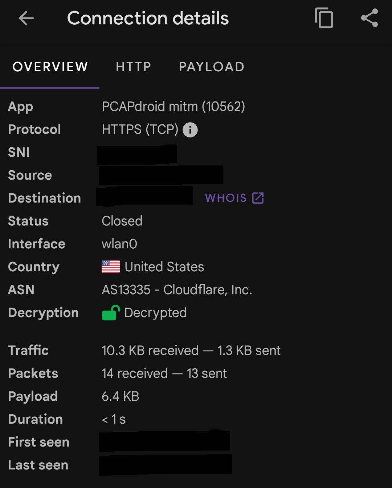

# 1. Overview

I reverse-engineered an Android app’s API using only my phone (no PC required for packet capture). The goal was to capture and decrypt the app’s network traffic to learn API endpoints and credentials. The key result was successfully decrypting traffic and finding an API key that had not changed for about a month.

# 2. Environment

Device: Android phone (rooted)

Root method: Magisk

All capture and most manipulation done on the phone except a short openssl step that was run on a PC to compute a certificate hash (transferred the file back and forth between phone and PC).

# 3. Tools used

Magisk — to root the phone.

PCAPdroid — traffic capture app on Android.

ZArchiver — file manager with root support to copy the cert into system directories.

OpenSSL (on PC) — to compute the hash/filename for the CA certificate.

# 4. Step-by-step actions taken (as performed)

1. Rooted the Android phone using Magisk.

2. Root was required to modify system certificate storage later.

3. Installed PCAPdroid on the phone and started capturing network traffic.

4. Captures initially showed encrypted TLS traffic (unreadable).

5. Enabled TLS decryption in PCAPdroid and installed the PCAPdroid-mitm addon and its custom CA certificate on the device as a user certificate.

6. Attempted to decrypt traffic — received an error: decryption failed.

7. Investigation showed the target app did not trust user-installed certificates.

8. followed [this guide](https://emanuele-f.github.io/PCAPdroid/tls_decryption) for troubleshooting:

"Starting from Android 7, when targetting the Android SDK 23 or later, apps no longer trust any user-installed certificates and instead rely only on the system-installed certificates i.e those that came pre-installed in your phone’s OS, installed by default"

9. To make the custom CA trusted by the system, followed [another guide](https://docs.mitmproxy.org/stable/howto/install-system-trusted-ca-android/) to install the custom CA as a system certificate:

- Copied the custom CA certificate generated by PCAPdroid from the phone to a PC.

- On the PC ran:
```bash
hashed_name=`openssl x509 -inform PEM -subject_hash_old -in mitmproxy-ca-cert.cer | head -1` && cp mitmproxy-ca-cert.cer $hashed_name.0
```

10. Sent the hashed filename certificate back to the Android device.

11. On the phone, used ZArchiver (with root) to move the hashed cert file into the system certificate directory:

```Destination: /system/etc/security/cacerts/```

This write requires root access and remounting /system read/write (the root provided by Magisk made the operation possible).

12. Restarted the phone and re-started packet capture in PCAPdroid.

TLS decryption now succeeded — traffic decrypted.


13. Analyzed the decrypted traffic and discovered API details including an API key that had not been changed for about a month.


# 5. Problems encountered & solutions

* Problem: Captured TLS traffic was encrypted and unreadable.
Root cause: TLS — traffic is encrypted by design. PCAPdroid provides MITM decryption but requires the interception CA certificate to be trusted by the app.

* Problem: Decryption failed after installing PCAPdroid’s CA as a user certificate.
Root cause: Android apps targeting SDK ≥ 23 (and Android 7+ behavior) do not trust user-installed CAs by default. They only trust system (OS) CAs.

* Solution: Install the custom CA as a system CA so the target app will trust it.

* Compute the hashed filename expected by Android certificate store (openssl x509 -subject_hash_old …).

* Place the cert into /system/etc/security/cacerts/ using a root-capable file manager (ZArchiver) or other root tools.

* After installing as system CA and rebooting, PCAPdroid-mitm could decrypt TLS and packets became readable.

# 6. Findings / Results

* Successful decryption of TLS traffic from the target Android app.

* Extracted API details (endpoints, parameters) and an API key that appeared unchanged for ~1 month.

All work (capture, decryption, analysis) was performed on the phone, with only a small openssl step executed on a PC for certificate hashing — otherwise no PC was required.
